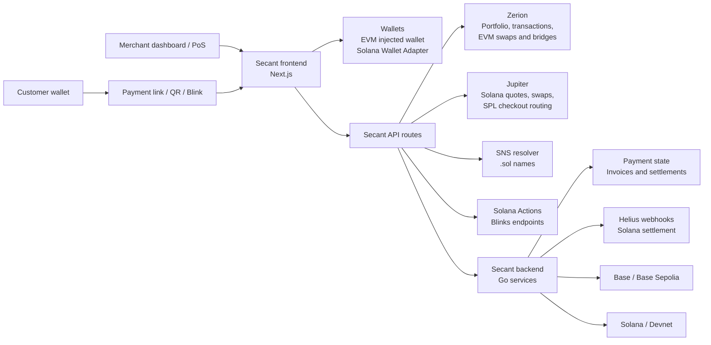

# Architecture

Secant Pay is organized as a product workspace with a Next.js frontend, Go backend, and TypeScript SDK.

```text
Secant/
  Secant-Pay/
    Secant-frontend/    Next.js app and API routes
    Secant-backend/     Go backend for payment validation and settlement state
  Secant-SDK/           Publishable TypeScript SDK
  docs/                 GitBook documentation
```

## System Diagram



## Frontend

The frontend is the main merchant and customer interface. It handles wallet connection, dashboard state, checkout screens, invoice creation, QR rendering, Scan & Pay, and Swap & Bridge UI.

The frontend also contains API routes for provider-backed operations that should not be called directly from browser components, including Zerion, Jupiter, SNS, Helius webhook handling, and Solana Actions metadata.

## Backend

The Go backend validates payment requests, stores invoice and payment state, and exposes settlement status for the frontend and SDK.

The backend is designed around the idea that Secant observes and verifies payments, while the chain remains the source of truth for settlement.

## SDK

The TypeScript SDK gives external apps a clean way to create payment sessions, track status, and embed Secant checkout flows without depending on frontend internals.

## Data Flow

1. Merchant connects EVM and Solana wallets.
2. Secant fetches portfolio data for all connected wallets.
3. Merchant creates a terminal checkout, invoice, or PoS payment.
4. Customer pays from Base or Solana.
5. Secant observes settlement through provider APIs, chain reads, references, and webhooks.
6. Payment status updates in dashboard, invoices, history, and SDK consumers.

## Settlement Model

Secant does not hold user funds. A payment is considered settled only after on-chain evidence confirms the expected recipient, amount, asset, chain, and reference or transaction identity.

