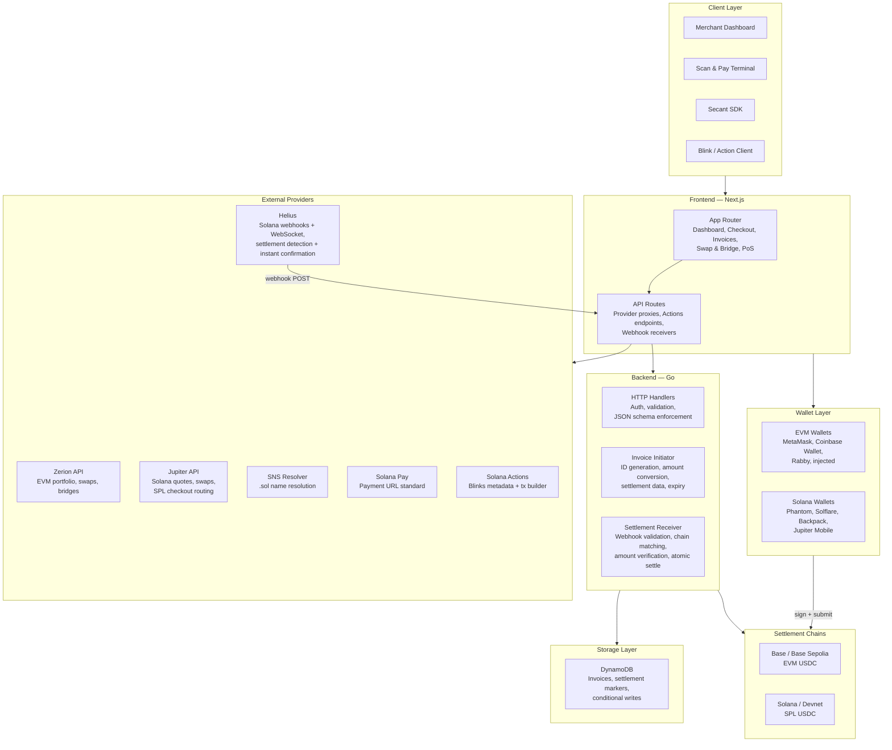
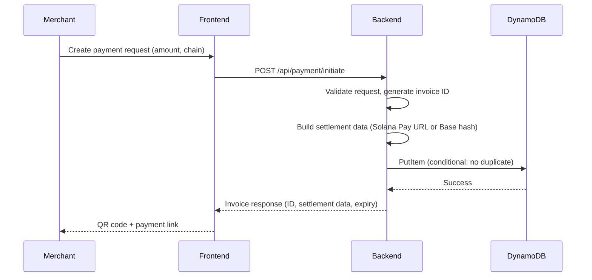
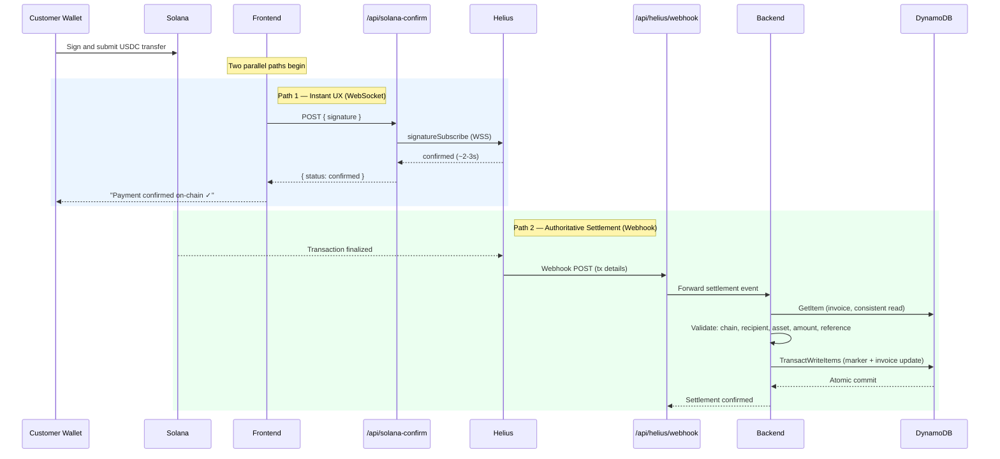
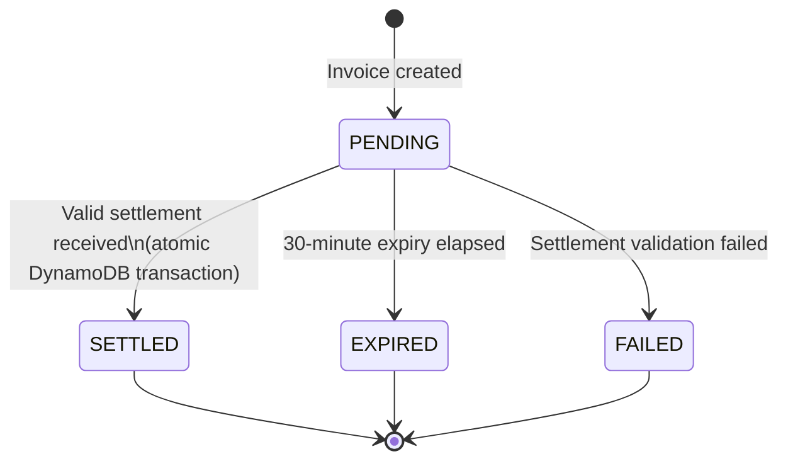

# Architecture

Secant Pay is a modular payment platform built as a monorepo workspace with clear separation between the merchant-facing frontend, the payment validation backend, and a publishable SDK.

## Repository Structure

```text
Secant/
  Secant-Pay/
    Secant-frontend/       Next.js 14 app with App Router and API routes
    Secant-backend/        Go backend — invoice lifecycle, settlement validation, webhooks
  Secant-SDK/              TypeScript SDK — payment intents, status polling, embeddable checkout
  Secant Pay docs/         GitBook documentation (this repo)
```

## System Architecture



## Component Detail

### Frontend — Next.js

The frontend serves as both the merchant interface and the API gateway. Built on Next.js 14 with the App Router.

| Layer | Responsibility |
|-------|---------------|
| Dashboard | Portfolio balances, asset breakdown, activity feed across connected wallets |
| Terminal | USDC checkout with chain selection, QR generation, payment status polling |
| Scan & Pay | Point-of-sale interface with QR scanning, amount keypad, balance validation |
| Invoices | Invoice creation, payment link generation, Blinks integration, status tracking |
| Swap & Bridge | Token routing UI with slippage controls, powered by Jupiter and Zerion |
| API Routes | Server-side proxies for provider APIs, webhook receivers, Actions endpoints, and real-time transaction confirmation via Helius WebSocket. API keys never reach the browser — all provider calls route through server-side handlers. |

### Backend — Go

The backend is a stateless service responsible for invoice lifecycle management and settlement validation. Designed for deployment as AWS Lambda functions or standalone HTTP services.

| Component | Responsibility |
|-----------|---------------|
| Invoice Initiator | Validates merchant requests, generates cryptographically random invoice IDs (`inv_` + 16 bytes hex), converts USD amounts to atomic units, builds chain-specific settlement data (Solana Pay URL with reference keypair, or Base invoice hash), sets 30-minute expiry |
| Settlement Receiver | Validates inbound webhook payloads against stored invoice state — chain, recipient, asset, amount, reference/signature must all match. Settles atomically via DynamoDB transactions |
| HTTP Handlers | Bearer token authentication, strict JSON schema enforcement via `DisallowUnknownFields()`, structured error responses with typed error codes |

### Storage — DynamoDB

Single-table design with `invoice_id` as the partition key.

| Record Type | Key Pattern | Purpose |
|-------------|-------------|---------|
| Invoice | `inv_{random_hex}` | Invoice state, settlement data, timestamps |
| Settlement marker | `settlement#{chain}:{tx_id}` | Prevents double-settlement of the same transaction |

Key guarantees:

- **No duplicate invoices.** `PutItem` with `attribute_not_exists(invoice_id)` condition.
- **No double settlement.** `TransactWriteItems` atomically creates a settlement marker and updates the invoice, both with condition expressions. If the marker already exists or the invoice is not `PENDING`, the transaction fails.
- **Strong consistency.** `GetItem` uses `ConsistentRead: true` for settlement validation reads.

### SDK — TypeScript (Phase 2)

The SDK provides a programmatic interface for external applications to create payment sessions, poll status, verify webhooks, and embed checkout components. See [Phase 2: Growth Rails](./phase-2-growth-rails.md) for full SDK scope.

## Data Flow

### Payment Creation



### Settlement Detection

Two complementary paths run in parallel after a Solana payment is signed. The WebSocket path delivers instant UX feedback; the webhook path is the authoritative settlement mechanism.



For Base payments, the flow uses only the webhook path — the WebSocket confirmation is Solana-specific.

### Invoice Lifecycle



## Settlement Model

Secant does not hold user funds. A payment is considered settled only after on-chain evidence confirms all of the following:

| Field | Validation |
|-------|-----------|
| Chain | Webhook chain matches invoice chain |
| Recipient | Transaction recipient matches merchant wallet stored in invoice |
| Asset | Token address or mint matches expected stablecoin |
| Amount | Atomic amount matches exactly (no partial payments in Phase 1) |
| Reference | Solana: reference pubkey matches. Base: tx hash is valid |
| Status | Invoice is `PENDING` and not expired |

Settlement is atomic. The DynamoDB transaction either succeeds completely (marker created + invoice updated) or fails completely. There is no intermediate state where an invoice is partially settled.

## API Security

| Control | Implementation |
|---------|---------------|
| Authentication | Bearer token on all backend endpoints |
| Input validation | `DisallowUnknownFields()` rejects unexpected JSON fields |
| API key isolation | Provider API keys stay server-side in Next.js API routes, never sent to browser |
| Response sanitization | RPC proxy scrubs upstream URLs and API key fragments from error responses |
| Idempotency | Settlement markers prevent processing the same transaction twice |
| Expiry | Invoices expire after 30 minutes, enforced before settlement |

## Deployment

| Component | Target |
|-----------|--------|
| Frontend | Vercel (Next.js) |
| Backend | AWS Lambda (Go) or standalone HTTP |
| Storage | AWS DynamoDB |
| Webhooks | Helius (Solana), direct chain observation (Base) |

The backend is designed as stateless Lambda functions — each endpoint (initiate, settle, status) is independently deployable. The frontend API routes handle provider proxying and webhook ingestion at the edge.
