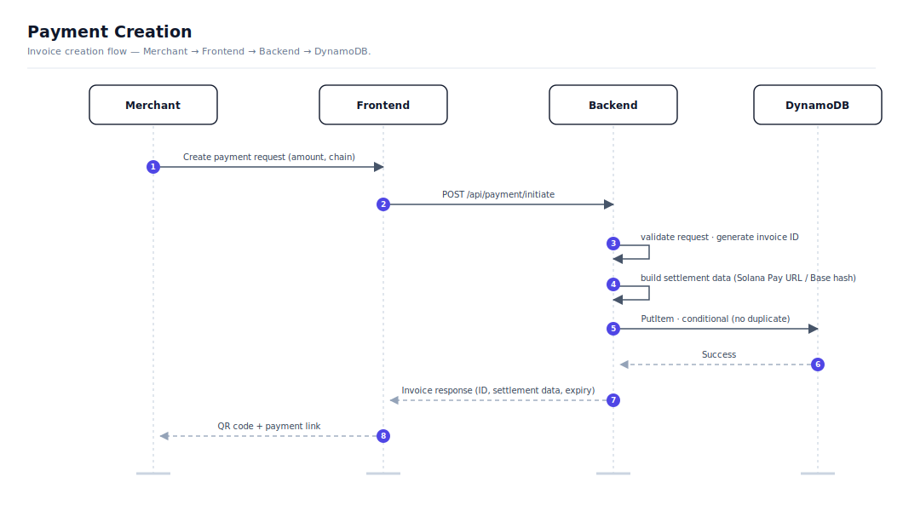
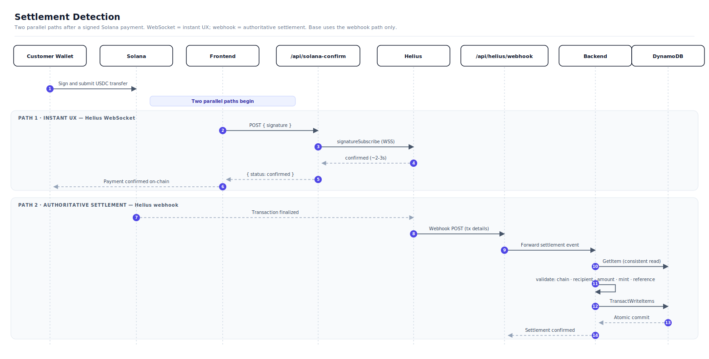
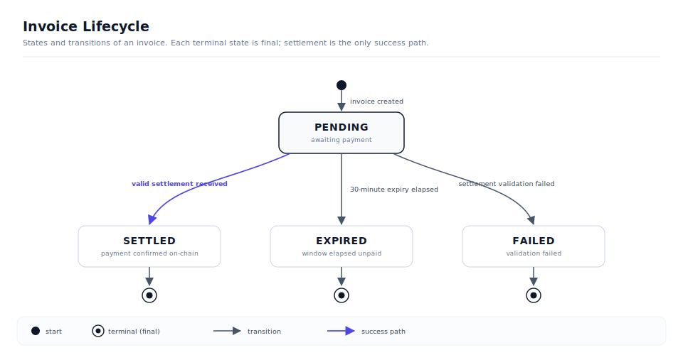

# Architecture

Secant Pay is a modular payment platform built as a monorepo workspace with clear separation between the merchant-facing frontend, the payment validation backend, and a publishable SDK.

## Repository Structure

```text
Secant/
  Secant-Pay/
    Secant-frontend/       Next.js 16 app with App Router and API routes
    Secant-backend/        Go backend — invoice lifecycle, settlement validation, webhooks
  Secant-SDK/              TypeScript SDK — payment intents, status polling, embeddable checkout
  Secant Pay docs/         GitBook documentation (this repo)
```

## System Architecture


## Component Detail

### Frontend — Next.js

The frontend serves as both the merchant interface and the API gateway. Built on Next.js 16 with the App Router.

| Layer | Responsibility |
|-------|---------------|
| Dashboard | Portfolio balances, asset breakdown, activity feed across connected wallets |
| Terminal | USDC checkout with chain selection, QR generation, payment status polling |
| Scan & Pay | Point-of-sale interface with QR scanning, amount keypad, balance validation |
| Invoices | Invoice creation, payment link generation, optional customer wallet request, Blinks integration, status tracking |
| Swap & Bridge | Token routing UI with slippage controls, powered by Jupiter and Zerion |
| API Routes | Server-side proxies for provider APIs, webhook receivers, Actions endpoints, Dialect request forwarding, and real-time transaction confirmation via Helius WebSocket. API keys never reach the browser — all provider calls route through server-side handlers. |

### Backend — Go

The backend is a stateless service responsible for invoice lifecycle management and settlement validation. Designed for deployment as AWS Lambda functions or standalone HTTP services.

| Component | Responsibility |
|-----------|---------------|
| Invoice Initiator | Validates merchant requests, generates cryptographically random invoice IDs (`inv_` + 16 bytes hex), converts USD amounts to atomic units, builds chain-specific settlement data (Solana Pay URL with reference keypair, or Base invoice hash), sets 30-minute expiry. Enforces the per-merchant monthly invoice quota (atomic counter, keyed by account wallet) and auto-registers Solana recipients on the Helius webhook |
| Merchant Settings + 2FA | Wallet-signature-gated read/write of the merchant profile (business name, contact, settlement mode, default chain, website, settlement addresses). Plan is server-controlled. Optional TOTP two-factor (AES-256-GCM encrypted secrets) for settings access |
| Usage Reader | Returns the authoritative plan + monthly invoice usage for an account (same counter enforcement uses), behind the initiator bearer token |
| Helius Address Manager | Appends Solana settlement addresses to the Helius webhook's watched list, idempotently (dedup table). API key/URL stay backend-only |
| Invoice Sweeper | Scheduled (EventBridge) job that transitions overdue `PENDING` invoices to `EXPIRED` via conditional write, refunds the quota slot, and stamps a TTL for auto-deletion |
| Payment Request Notifier | Sends optional Dialect Alerts to a customer Solana wallet after invoice creation. Notification delivery is separate from settlement and never changes invoice payment parameters |
| Settlement Receiver | Validates inbound webhook payloads against stored invoice state — chain, recipient, asset, amount, reference/signature must all match. Settles atomically via DynamoDB transactions |
| HTTP Handlers | Per-endpoint authentication (see API Security below), strict JSON schema enforcement via `DisallowUnknownFields()`, structured error responses with typed error codes |

### Storage — DynamoDB

The invoice table uses `invoice_id` as the partition key; a few small companion tables back settings, quota, and Helius dedup.

| Table | Key | Purpose |
|-------|-----|---------|
| `secant_invoices` | `invoice_id` (`inv_{random_hex}`) | Invoice state, settlement data, timestamps, `account_wallet`, `ttl`. Settlement markers (`settlement#{chain}:{tx_id}`) share this table to prevent double-settlement. TTL enabled on the `ttl` attribute for expired-invoice cleanup |
| `secant-merchant-settings` | `wallet_address` | Merchant profile, plan, settlement addresses, encrypted TOTP secret |
| `secant-usage` | `usage_key` (`{account_wallet}#{YYYY-MM}`) | Monthly invoice counter for plan enforcement |
| `secant-helius-watched` | `address` | Dedup registry so each Solana address is registered on the Helius webhook only once |

Key guarantees:

- **No duplicate invoices.** `PutItem` with `attribute_not_exists(invoice_id)` condition.
- **No double settlement.** `TransactWriteItems` atomically creates a settlement marker and updates the invoice, both with condition expressions. If the marker already exists or the invoice is not `PENDING`, the transaction fails.
- **Bypass-proof quota.** The monthly counter is incremented with an atomic conditional write, so concurrent requests can never exceed the cap; expired invoices decrement (refund) the counter.
- **Strong consistency.** `GetItem` uses `ConsistentRead: true` for settlement validation reads.

### SDK — TypeScript (Phase 2)

The SDK provides a programmatic interface for external applications to create payment sessions, poll status, verify webhooks, and embed checkout components. See [Phase 2: Programmable Payments](./phase-2-programmable-payments.md) for full SDK scope.

## Data Flow

### Payment Creation



Payment creation can return only a shareable pay link, or it can also send a Dialect request when the merchant supplies a customer Solana wallet. The notification is a delivery channel for the same invoice; it does not create a different settlement path.

### Settlement Detection

Two complementary paths run in parallel after a Solana payment is signed. The WebSocket path delivers instant UX feedback; the webhook path is the authoritative settlement mechanism.



For Base payments, the flow uses only the webhook path — the WebSocket confirmation is Solana-specific.

### Invoice Lifecycle



## Settlement Model

Secant does not hold user funds. A payment is considered settled only after on-chain evidence confirms all of the following:

| Field | Validation |
|-------|-----------|
| Chain | Webhook chain matches invoice chain |
| Recipient | Transaction recipient matches merchant wallet stored in invoice |
| Asset | Token address or mint matches expected stablecoin |
| Amount | Atomic amount matches exactly (no partial payments in Phase 1) |
| Reference | Solana: reference pubkey matches. Base: tx hash is valid |
| Status | Invoice is `PENDING` and not expired |

Dialect notifications, Blink renderers, QR codes, and hosted payment links are all request surfaces. None of them are settlement authority. The backend marks an invoice `SETTLED` only after the chain evidence matches the stored invoice record.

Settlement is atomic. The DynamoDB transaction either succeeds completely (marker created + invoice updated) or fails completely. There is no intermediate state where an invoice is partially settled.

## API Security

| Control | Implementation |
|---------|---------------|
| Authentication | Per-endpoint: invoice initiation requires a bearer token; the settlement webhook uses an HMAC signature; the Helius webhook uses a constant-time static bearer; the Zerion webhook uses RSA signature verification; Dialect request sending is server-side and uses backend-held credentials. Public payment-surface endpoints (invoice details, Blink action, Jupiter checkout) are intentionally unauthenticated — they expose only data a payment QR/Blink already carries and build *unsigned* transactions the payer must sign. Merchant settings requires a wallet-ownership signature (Solana ed25519 or EVM EIP-191) bound to a 10-minute timestamp, so a caller can only read or write its own profile. |
| Input validation | `DisallowUnknownFields()` rejects unexpected JSON fields |
| API key isolation | Provider API keys stay server-side in Next.js API routes, never sent to browser |
| Response sanitization | RPC proxy scrubs upstream URLs and API key fragments from error responses |
| Idempotency | Settlement markers prevent processing the same transaction twice |
| Expiry | Invoices expire after 30 minutes; a scheduled sweep flips `PENDING → EXPIRED`, refunds quota, and a DynamoDB TTL auto-deletes expired records |
| Two-factor (optional) | TOTP on top of the wallet signature for merchant settings; AES-256-GCM encrypted secrets, never returned to the client |
| Plan quota | Per-merchant monthly invoice cap enforced via atomic counter; server-controlled plan (no self-upgrade) |

## Deployment

| Component | Target |
|-----------|--------|
| Frontend | Vercel (Next.js) |
| Backend | AWS Lambda (Go) or standalone HTTP |
| Storage | AWS DynamoDB (invoices + settings/usage/Helius-dedup tables; TTL on invoices) |
| Scheduled jobs | EventBridge rule (~every 5 min) invoking the invoice-sweeper Lambda |
| Notification delivery | Dialect Alerts for customer-addressed invoice requests |

The backend is designed as stateless Lambda functions — each endpoint (initiate/usage, settle, status, invoice, action-pay, jupiter-checkout, merchant-settings + 2FA, zerion/helius webhooks) is independently deployable, plus a scheduled invoice-sweeper. The frontend API routes handle provider proxying and webhook ingestion at the edge.
