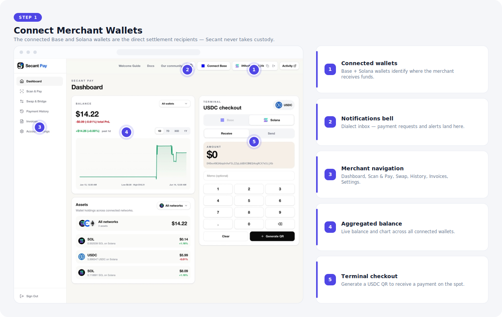
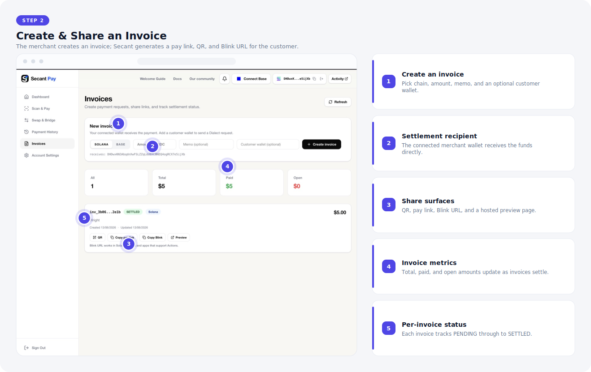
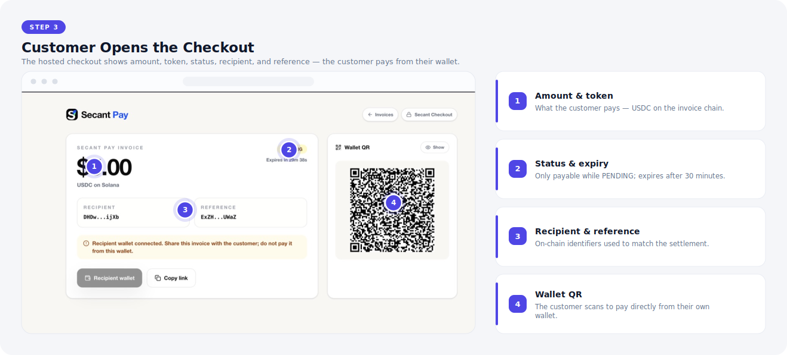
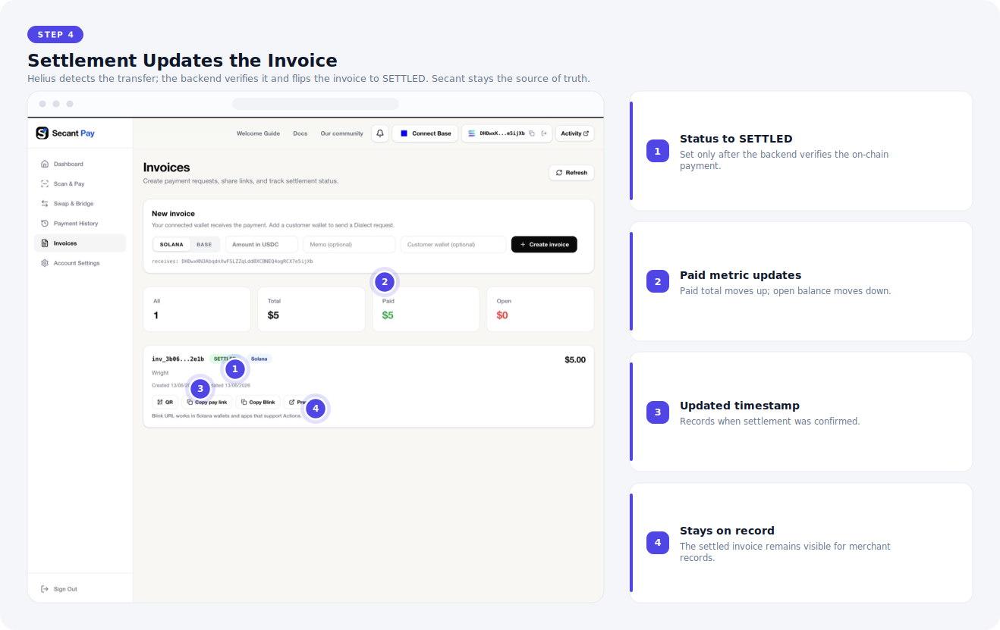
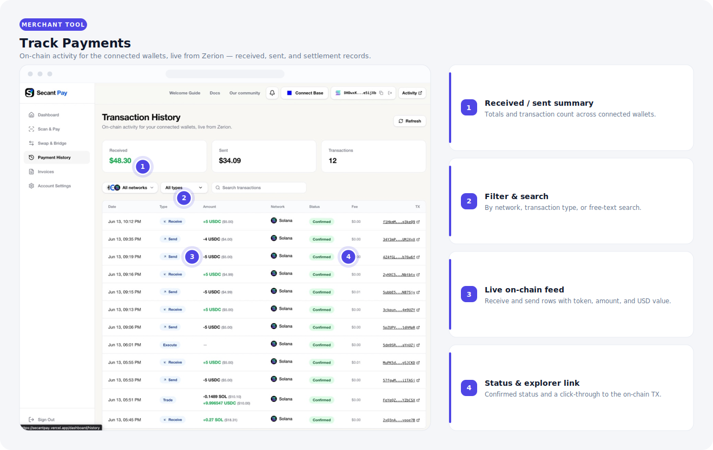
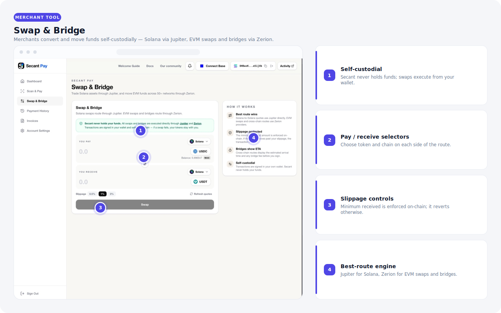

# How Secant Pay Works

Secant Pay is split into two clear roles:

- **Merchant:** creates invoices and receives the funds.
- **Customer:** opens the payment request and pays the merchant.

The merchant never receives funds through Secant custody. Payments settle directly from the customer wallet to the merchant wallet, while Secant coordinates invoice creation, request delivery, checkout, and settlement tracking.

## 1. Connect Merchant Wallets

- The connected Base and Solana wallets identify where the merchant receives funds.
- Dashboard balances, assets, terminal checkout, and navigation are merchant tools.
- Scan & Pay and terminal QR flows use the selected merchant wallet as the settlement address.

## 2. Create and Share an Invoice

- The merchant creates an invoice with chain, amount, memo, and optional customer wallet.
- The merchant wallet shown under the form is the recipient for settlement.
- Secant generates a pay link, wallet QR, Blink URL, and preview page for the invoice.
- If a customer wallet is supplied, Secant can send a Dialect payment request to that wallet inbox.

## 3. Customer Opens the Checkout

- The customer-facing checkout shows amount, token, memo, status, recipient, and reference.
- Customers can pay with the wallet QR or the supported wallet action route.
- Expired, settled, or otherwise unavailable invoices do not expose an active payment QR.

## 4. Settlement Updates the Invoice

- Helius notifies Secant when a matching Solana transfer is observed.
- Secant verifies the token mint, recipient, reference, amount, and invoice state before marking it settled.
- Once settled, the invoice updates from `PENDING` to `SETTLED`, paid metrics update, and the invoice stays visible for merchant records.

## Merchant Tools

Beyond the invoice flow, merchants manage and move funds from the same dashboard.

### Track Payments

- Payment History shows live on-chain activity for the connected wallets, sourced from Zerion.
- Received, sent, and transaction-count summaries give an at-a-glance view of merchant flow.
- Each row links to the on-chain transaction and shows confirmation status; filter by network, type, or search.

### Swap & Bridge

- Merchants can convert and move funds without leaving Secant — self-custodially.
- Solana swaps route through Jupiter; EVM swaps and cross-chain bridges route through Zerion.
- Minimum-received is enforced on-chain, so a swap reverts rather than filling past the chosen slippage.

## Important Boundaries

- Dialect Alerts deliver payment requests; they do not settle invoices.
- Blink URLs and hosted pay links are payment surfaces; they do not control invoice state.
- Helius webhooks are detection inputs; Secant's backend remains the source of truth for settlement status.
- A customer paying after expiry may still send funds on-chain, but Secant will not treat the expired invoice as payable or active.
