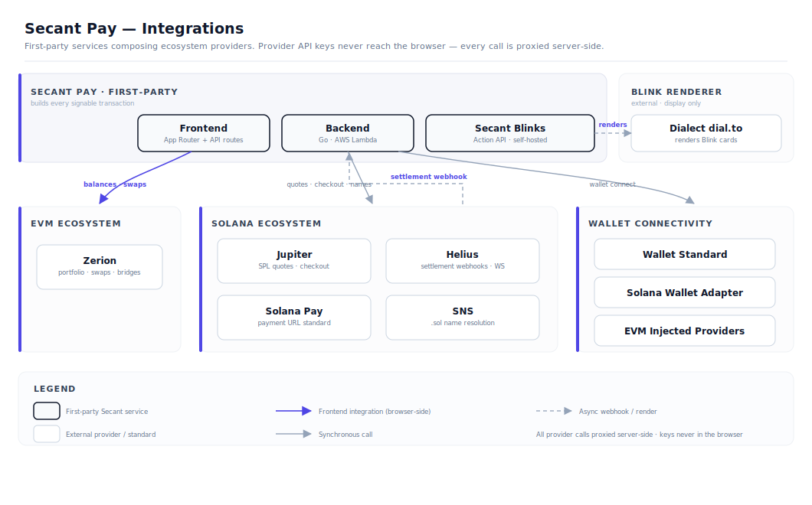

# Integrations

Secant composes ecosystem-standard providers for portfolio data, swap routing, settlement detection, name resolution, payment standards, Blinks rendering, and wallet-native notifications. Each privileged integration is accessed through server-side API routes — provider keys never reach the browser.

## Integration Map

## Zerion

Zerion powers all EVM portfolio data and swap/bridge routing.

| Capability | Usage |
|-----------|-------|
| Portfolio balances | Aggregated EVM wallet balances across Base and supported networks |
| Position metadata | Token positions, asset types, and network distribution |
| Transaction history | EVM activity feed for connected wallets |
| Chain metadata | Network information and chain-specific configuration |
| Swap routing | EVM token swap quotes with slippage controls |
| Bridge routing | Cross-chain route discovery for EVM networks |

Integration: Server-side API route proxies Zerion calls. API key stored as environment variable, never exposed to the client.

## Jupiter

Jupiter powers Solana liquidity, swap execution, and checkout routing.

| Capability | Usage |
|-----------|-------|
| Swap quotes | Solana-to-Solana token swap quotes with route optimization |
| Checkout routing | Customer pays with SOL or SPL token, Jupiter routes to merchant USDC |
| Price impact | Route-level price impact and minimum received calculation |
| Token list | Supported SPL tokens for swap and checkout |

Integration: Jupiter API called through Next.js API routes for quote fetching and swap transaction building.

## Solana Pay

Solana Pay provides the payment URL standard for QR and link-based payment requests.

| Capability | Usage |
|-----------|-------|
| Payment URL generation | `solana:` scheme URLs with recipient, amount, SPL token, reference, and memo |
| QR checkout | QR codes encoding the full Solana Pay URL for wallet scanning |
| Reference keys | Unique reference keypair per payment for settlement matching |
| Manual paste | Fallback for payment payloads when QR scanning is unavailable |

Integration: Payment URLs constructed in the frontend following the Solana Pay specification. Compatible wallets (Phantom, Solflare, Jupiter Mobile) parse the URL and auto-fill the transaction.

## Solana Actions and Secant Blinks

Secant runs its **own** Solana Action API — "Secant Blinks." An invoice unfurls as a payable card in any Blinks-compatible client, and the signable transaction is assembled by the Secant Go backend, not by any third party.

| Capability | Usage |
|-----------|-------|
| Action metadata | Invoice details served as Actions-compliant JSON on `GET`. When an invoice has a memo, it appears in the Blink card title and description. Settled/expired invoices render a disabled card. |
| Transaction builder | The payment transaction is assembled on `POST` by the backend (`ActionPayService`). Recipient, amount, USDC mint, Solana Pay reference, and the invoice memo all come from the stored invoice — the caller can only supply its own payer account. This keeps Blinks self-custodial and invoice-addressed: a tampered URL cannot redirect funds or change the amount. |
| Discovery | `actions.json` maps `/pay/*` and `/api/actions/**` on the public origin to the Action API, so wallets and unfurlers can find the endpoints. |

Integration: Next.js API routes (`/api/actions/pay/{id}` and `actions.json`) are thin proxies to the Go backend (`/action/pay/{id}`), which implements the Actions specification. The backend is the single audited path that turns an invoice into signable bytes.

### Renderers — where a Blink is displayed

The Action API is one thing; *rendering* the card is separate. Secant Blinks are displayed by three independent surfaces, all pointing at the same Secant endpoint:

| Renderer | Role |
|----------|------|
| Secant checkout (`/pay/{invoice}`) | The branded, in-app payable card — the primary first-party surface. |
| Native Blink clients (Phantom, Backpack, X unfurler) | Discover the action via `actions.json` and the `solana-action:` URI and render it natively. |
| Dialect `dial.to` | A universal hosted web renderer. The invoice page's "Copy Blink" / "Open Blink" buttons wrap the Secant action URL as `dial.to/?action=solana-action:<secant-url>` so the Blink renders as a shareable card even outside native clients. |

### Dialect as a Blink renderer

For Blinks, Dialect (`dial.to`) is a renderer/distribution surface, not part of the transaction path. There is no Dialect-hosted action and no Dialect dependency in the transaction builder — the transaction is always built by the Secant backend. `dial.to` is the convenient "share a Blink link anywhere and it renders" wrapper; it is not a fallback for transaction building. If `dial.to` were removed, the raw `solana-action:` URL plus `actions.json` would still render in native Blink-aware wallets — only the universal web preview would be lost.

## Dialect Alerts

Dialect Alerts powers wallet-addressed invoice requests and the in-app notification inbox.

| Capability | Usage |
|-----------|-------|
| Customer payment requests | When a merchant adds a customer Solana wallet while creating an invoice, Secant sends a Dialect in-app alert with the invoice context and pay link. |
| Dashboard inbox | The notification bell in the Secant dashboard embeds a Dialect inbox so users can review payment requests and alerts from inside Secant. |
| Wallet-based subscription | Notifications are tied to the customer's wallet identity and Dialect subscription state, not a Secant password account. |
| Multi-channel foundation | Dialect can support in-app, email, Telegram, and push-style delivery depending on app and user configuration. Phase 1 uses the in-app request flow. |

Integration: Secant keeps the Dialect API key server-side when sending alerts. The browser receives only the public client key needed to render the inbox and subscription UI. A Dialect alert is a delivery mechanism for a Secant invoice; it does not alter the recipient, amount, mint, expiry, reference, or settlement state.

## Helius

Helius powers native Solana settlement detection via webhooks and real-time transaction confirmation via LaserStream WebSocket.

| Capability | Usage |
|-----------|-------|
| Webhook delivery | Real-time notification when a Solana transaction matches monitored criteria |
| WebSocket confirmation | Instant on-chain confirmation via `signatureSubscribe` — up to 200 ms faster than standard Solana WebSockets |
| Devnet support | Settlement detection works on both devnet and mainnet |
| Reference matching | Webhook payloads include transaction details for reference-based invoice matching |

Integration: Two complementary paths.

**Settlement authority (webhooks):** Helius webhook POSTs to a Next.js API route, which forwards to the Go backend for settlement validation. Because Helius can deliver events at confirmed commitment before finalization, the backend re-verifies the transaction at confirmed commitment and then checks it against stored invoice state before marking it settled. This is the authoritative settlement path.

**Instant UX confirmation (WebSocket):** After a customer signs a Solana transaction, the frontend calls a server-side API route that opens a Helius WebSocket connection and subscribes to the transaction signature. The route returns the confirmation status within 2–3 seconds. The API key stays server-side — the browser never connects directly to Helius. If the WebSocket connection fails, the route falls back to `getSignatureStatuses` polling automatically.

## SNS (Solana Name Service)

SNS resolves `.sol` domain names to Solana wallet addresses.

| Capability | Usage |
|-----------|-------|
| Name resolution | Resolve `merchant.sol` to a Solana public key |
| Recipient convenience | Merchants and customers can use `.sol` names instead of raw addresses |

Integration: Resolved via API route using the SNS SDK. The resolved address is used for transaction building and display.

## Wallet Connectivity

### EVM Wallets

Connected via injected browser providers using standard EIP-1193 interfaces.

Supported wallets: MetaMask, Coinbase Wallet, Rabby, and other injected EVM wallets.

### Solana Wallets

Connected via the Solana Wallet Adapter library implementing the Wallet Standard specification.

Supported wallets: Phantom, Solflare, Backpack, Jupiter Mobile, and other Wallet Standard-compatible wallets.

Both wallet types maintain separate identity in the UI. The merchant connects an EVM wallet for Base operations and a Solana wallet for Solana operations — there is no forced wallet abstraction across chains.
