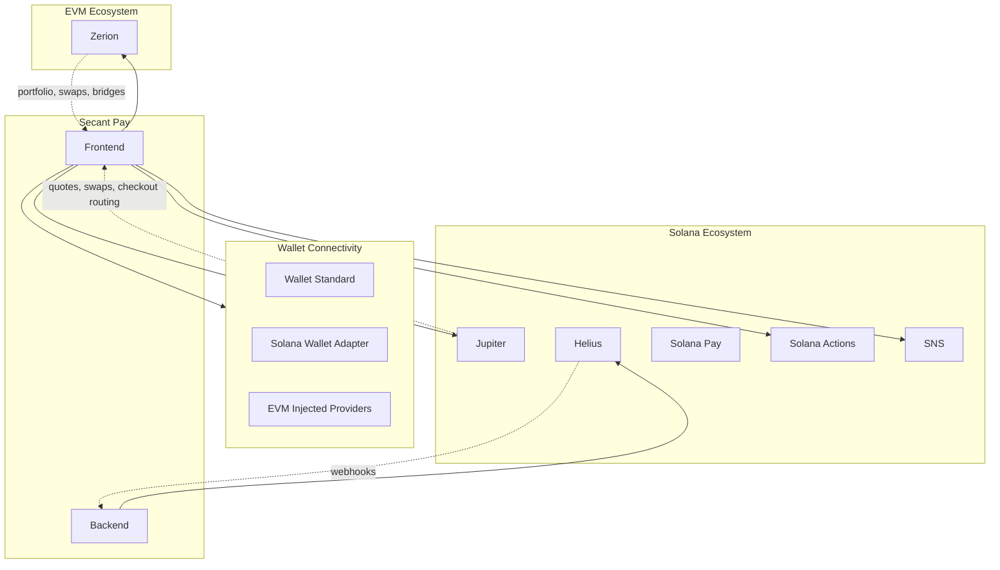

# Integrations

Secant composes ecosystem-standard providers for portfolio data, swap routing, settlement detection, name resolution, and payment standards. Each integration is accessed through server-side API routes — provider keys never reach the browser.

## Integration Map

## Zerion

Zerion powers all EVM portfolio data and swap/bridge routing.

| Capability | Usage |
|-----------|-------|
| Portfolio balances | Aggregated EVM wallet balances across Base and supported networks |
| Position metadata | Token positions, asset types, and network distribution |
| Transaction history | EVM activity feed for connected wallets |
| Chain metadata | Network information and chain-specific configuration |
| Swap routing | EVM token swap quotes with slippage controls |
| Bridge routing | Cross-chain route discovery for EVM networks |

Integration: Server-side API route proxies Zerion calls. API key stored as environment variable, never exposed to the client.

## Jupiter

Jupiter powers Solana liquidity, swap execution, and checkout routing.

| Capability | Usage |
|-----------|-------|
| Swap quotes | Solana-to-Solana token swap quotes with route optimization |
| Checkout routing | Customer pays with SOL or SPL token, Jupiter routes to merchant USDC |
| Price impact | Route-level price impact and minimum received calculation |
| Token list | Supported SPL tokens for swap and checkout |

Integration: Jupiter API called through Next.js API routes for quote fetching and swap transaction building.

## Solana Pay

Solana Pay provides the payment URL standard for QR and link-based payment requests.

| Capability | Usage |
|-----------|-------|
| Payment URL generation | `solana:` scheme URLs with recipient, amount, SPL token, reference, and memo |
| QR checkout | QR codes encoding the full Solana Pay URL for wallet scanning |
| Reference keys | Unique reference keypair per payment for settlement matching |
| Manual paste | Fallback for payment payloads when QR scanning is unavailable |

Integration: Payment URLs constructed in the frontend following the Solana Pay specification. Compatible wallets (Phantom, Solflare, Jupiter Mobile) parse the URL and auto-fill the transaction.

## Solana Actions and Blinks

Solana Actions expose invoice payment endpoints that unfurl as payable cards in Blinks-compatible clients.

| Capability | Usage |
|-----------|-------|
| Action metadata | Invoice details served as Actions-compliant JSON |
| Transaction builder | Payment transaction generated on POST from the Action client |
| Blinks display | Invoices appear as interactive payment cards in supporting clients |

Integration: Next.js API routes implement the Solana Actions specification (`actions.json` + GET/POST endpoints per invoice).

## Helius

Helius powers native Solana settlement detection via webhooks.

| Capability | Usage |
|-----------|-------|
| Webhook delivery | Real-time notification when a Solana transaction matches monitored criteria |
| Devnet support | Settlement detection works on both devnet and mainnet |
| Reference matching | Webhook payloads include transaction details for reference-based invoice matching |

Integration: Helius webhook POSTs to a Next.js API route, which forwards to the Go backend for settlement validation. The backend verifies the payment against stored invoice state before marking it settled.

## SNS (Solana Name Service)

SNS resolves `.sol` domain names to Solana wallet addresses.

| Capability | Usage |
|-----------|-------|
| Name resolution | Resolve `merchant.sol` to a Solana public key |
| Recipient convenience | Merchants and customers can use `.sol` names instead of raw addresses |

Integration: Resolved via API route using the SNS SDK. The resolved address is used for transaction building and display.

## Wallet Connectivity

### EVM Wallets

Connected via injected browser providers using standard EIP-1193 interfaces.

Supported wallets: MetaMask, Coinbase Wallet, Rabby, and other injected EVM wallets.

### Solana Wallets

Connected via the Solana Wallet Adapter library implementing the Wallet Standard specification.

Supported wallets: Phantom, Solflare, Backpack, Jupiter Mobile, and other Wallet Standard-compatible wallets.

Both wallet types maintain separate identity in the UI. The merchant connects an EVM wallet for Base operations and a Solana wallet for Solana operations — there is no forced wallet abstraction across chains.
