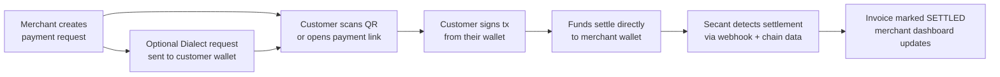

# Product Overview

Secant Pay is a payment operating system for merchants who work across Base and Solana.

The product combines checkout, invoices, customer payment requests, point-of-sale payments, portfolio visibility, and swap routing into one self-custodial workflow. A merchant connects an EVM wallet and a Solana wallet, creates payment requests, shares a payment link or QR code, optionally sends the request to a customer's Dialect inbox, and tracks settlement — without giving Secant custody over funds.

## Core Jobs

### Accept Payments

Merchants request USDC on Base or Solana. Customers scan a QR code, open a payment link, receive a Dialect in-app request, or pay from a Solana Action / Blink. On Solana, customers can pay with SOL or any supported SPL token — Jupiter routes the swap so the merchant always receives USDC.

### Track Settlement

Secant tracks payment state through on-chain data, Solana reference keys, Helius webhook events, and Zerion activity feeds. The backend validates every settlement against the expected chain, recipient, asset, amount, and reference before marking an invoice as paid. See [Security and Settlement](./security-and-settlement.md) for the full validation model.

### Manage Invoices

Invoices become shareable payment links. On Solana, invoice links also expose Action endpoints so they unfurl as payable cards in clients that support Blinks. Merchants can add a customer Solana wallet to send a Dialect request automatically; the request points back to the same Secant pay link and invoice settlement record. Each invoice carries a 30-minute expiry, unique reference, and full settlement data for the target chain. Plans set a monthly invoice allowance (Starter includes 10 active invoices/month; Growth and Enterprise are unlimited), and unpaid invoices that expire refund their slot automatically.

### Swap and Bridge

Solana-to-Solana swaps route through Jupiter with price impact and minimum received shown before signing. EVM swaps and cross-chain bridge routes use Zerion-powered routing with slippage controls.

### Portfolio Visibility

Aggregated balance and asset views across all connected wallets. Network distribution, position metadata, and transaction history from portfolio providers — all in one dashboard without switching between block explorers.

## How It Works

At no point does Secant hold, escrow, or route funds through its own wallets. The customer's wallet sends directly to the merchant's wallet. Secant's role is coordination: building the payment request, encoding the transaction parameters, and verifying that the on-chain result matches what was expected.

## Current Audience

| Segment | Use Case |
|---------|----------|
| Freelancers and agencies | Generate payment links, send customer wallet requests, receive USDC settlement |
| Global merchants | Request stablecoin payments, track on-chain settlement, manage across networks |
| Solana-native teams | Blinks, Solana Pay, Jupiter checkout — accept diverse SPL tokens, settle in USDC |
| EVM users | Portfolio visibility, Base USDC payments, swap and bridge routing |

## Product Principles

**Self-custodial.** Wallets sign directly. Funds settle to merchant-owned addresses. Secant never holds keys or balances.

**Two-chain first.** Base and Solana are treated as first-class rails with native tooling, not abstracted behind a generic multi-chain wrapper.

**USDC-centered.** Checkout and settlement are optimized around stablecoin payments. Token flexibility at the customer layer, stablecoin certainty at the merchant layer.

**Composable.** Routing, balances, settlement detection, name resolution, Blinks, and wallet-native notification inboxes use ecosystem-standard providers (Jupiter, Zerion, Helius, SNS, Solana Pay, Dialect). Secant composes existing infrastructure rather than rebuilding it.

**Open.** The SDK, checkout components, and Action endpoints are designed for external developers to build on — not just for Secant's own frontend.
