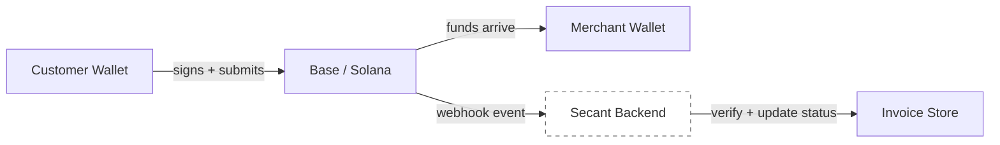
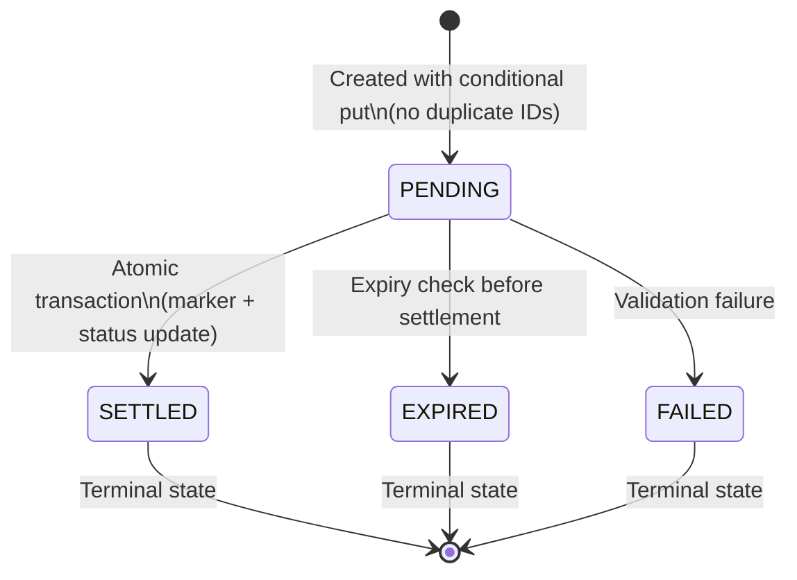

# Security and Settlement

Secant is designed as a self-custodial payment product. The application coordinates payment requests, routing, and settlement tracking. Wallets sign transactions directly and funds settle to merchant-controlled addresses.

## Custody Model

### What Secant Does Not Do

- Hold private keys for any wallet.
- Custody merchant or customer funds at any point in the payment flow.
- Move funds without explicit wallet approval and user signature.
- Replace on-chain settlement with internal ledger balances.
- Store seed phrases, mnemonics, or wallet recovery material.

### What Secant Does

- Create payment requests with chain-specific settlement parameters.
- Send optional customer payment request notifications for invoices.
- Build unsigned transaction payloads for connected wallets to sign.
- Track expected payment amounts, recipients, assets, and references.
- Verify settlement by matching on-chain evidence against stored invoice state.
- Store invoice status and settlement metadata in a backend database.

Secant is the dashed box — it observes the payment flow but is never in the fund path.

## Settlement Validation

A payment is marked `SETTLED` only after the backend validates all of the following against the stored invoice:

| Field | Validation Rule |
|-------|----------------|
| Chain | Webhook chain must match invoice chain exactly |
| Recipient | Transaction recipient must match the merchant wallet address stored in the invoice settlement data |
| Asset | Token address (Base) or token mint (Solana) must match the expected stablecoin |
| Amount | Atomic amount must match exactly — no partial payments, no rounding tolerance |
| Reference | Solana: reference public key must match. Base: transaction hash must be valid format |
| Invoice status | Invoice must be `PENDING` — already settled, expired, or failed invoices are rejected |
| Expiry | Invoice must not have passed its 30-minute expiry window |

If any field fails validation, the settlement is rejected and the invoice status is unchanged.

## Request Delivery vs Settlement Authority

Secant now supports several ways to deliver the same invoice to a customer:

- Hosted pay page.
- Solana Pay wallet QR.
- Secant Blink / Solana Action URL.
- Dialect payment request alert to a customer Solana wallet.

These are delivery surfaces only. They help the customer find and open the invoice, but they do not control settlement. The invoice recipient, amount, mint, reference, and expiry are stored server-side when the invoice is created. A notification or Blink renderer cannot change those fields, and an invoice is not marked paid until the backend validates matching on-chain evidence.

## Atomic Settlement

Settlement is executed as a DynamoDB `TransactWriteItems` operation with two items:

1. **Settlement marker** (`settlement#{chain}:{tx_id}`) — created with `attribute_not_exists` condition. If this marker already exists, the transaction was already processed.
2. **Invoice update** — status set to `SETTLED` with condition `attribute_exists(invoice_id) AND status = PENDING`. If the invoice was already settled or doesn't exist, the transaction fails.

Both items succeed or both fail. There is no intermediate state. This provides:

- **No double settlement.** The same on-chain transaction cannot settle two invoices or settle the same invoice twice.
- **No race conditions.** Concurrent webhook deliveries for the same transaction are safely serialized by DynamoDB's conditional write semantics.
- **No phantom settlements.** An invoice cannot be marked settled without a corresponding settlement marker on record.

## Invoice Lifecycle Security

| Transition | Protection |
|-----------|-----------|
| Creation | `attribute_not_exists(invoice_id)` prevents duplicate invoice IDs |
| Settlement | `TransactWriteItems` with dual conditions prevents double-settle |
| Expiry | Checked server-side before settlement processing, not client-side |
| Status reads | `ConsistentRead: true` for settlement validation to prevent stale reads |

## API Security

| Control | Detail |
|---------|--------|
| **Authentication** | Per-endpoint: bearer token on invoice initiation; HMAC signature on the settlement webhook; constant-time static bearer on the Helius webhook; RSA signature on the Zerion webhook; server-held Dialect credentials for alert sending. Public payment-surface endpoints (invoice details, Blink action, Jupiter checkout) are intentionally unauthenticated — they expose only data a payment QR/Blink already carries and build *unsigned* transactions the payer must sign. Merchant settings requires a per-wallet ownership signature (Solana ed25519 / EVM EIP-191), so a caller can only read or write its own profile |
| **Input validation** | Go `json.Decoder` with `DisallowUnknownFields()` rejects payloads containing fields not defined in the request struct |
| **API key isolation** | Provider API keys (Zerion, Jupiter, Helius, Solana RPC, Dialect Alerts API key) are stored as server-side environment variables. Next.js API routes proxy all privileged provider calls — keys never appear in browser-accessible code or network responses |
| **Response sanitization** | The Solana RPC proxy scrubs upstream URLs, origin headers, and query parameter values (potential API key fragments) from responses before returning to the client |
| **No client-side secrets** | Only `NEXT_PUBLIC_` prefixed variables reach the browser bundle. Provider keys use non-public env vars |
| **Error isolation** | Structured error codes returned to clients. Internal error details, stack traces, and provider responses are not leaked |

## Solana Transaction Reliability

Solana transfers use official `@solana/spl-token` tooling for instruction building — not hand-crafted byte layouts. Compute budget priority fees are attached to transactions where relevant, improving landing rates under network congestion.

Associated token account creation is handled automatically when required for SPL token transfers.

## Webhook Handling

Webhook events from Helius are treated as settlement signals, not as the sole source of truth. The backend:

1. Receives the webhook payload.
2. Looks up the referenced invoice with a consistent read.
3. Re-verifies the Solana transaction at confirmed commitment, matching Helius webhook timing.
4. Validates the payload against stored invoice state (chain, recipient, asset, amount, reference).
5. Only then executes the atomic settlement transaction.

Webhook replay and duplicate delivery are handled by the settlement marker — if the marker already exists, the duplicate webhook is safely rejected without modifying invoice state.

## Real-Time Transaction Confirmation

Solana payments use a dual-path confirmation model:

| Path | Purpose | Speed | Authority |
|------|---------|-------|-----------|
| WebSocket confirmation | Instant UI feedback to customer | ~2-3 seconds | Read-only — does not modify invoice state |
| Webhook settlement | Authoritative invoice settlement | ~5-15 seconds | Writes to DynamoDB via atomic transaction |

After a customer signs a Solana transaction, the frontend calls a server-side API route (`/api/solana-confirm`) that opens a Helius LaserStream WebSocket connection and subscribes to the transaction signature. The confirmation result is returned to the browser within seconds.

Security properties:

- **API key isolation.** The Helius WebSocket URL (which contains the API key) is only used server-side. The browser calls `/api/solana-confirm` with just the transaction signature.
- **Read-only.** The WebSocket confirmation path cannot modify invoice state. It only reports whether a transaction was confirmed or failed on-chain.
- **Automatic fallback.** If the WebSocket connection fails (network issue, Helius outage), the route falls back to `getSignatureStatuses` RPC polling with the same timeout guarantee.
- **Settlement authority unchanged.** The webhook path remains the sole mechanism for marking invoices as `SETTLED`. The WebSocket path is purely for user experience.

## Testnet Isolation

Testnet mode uses Base Sepolia and Solana Devnet. Settlement detection on Solana devnet uses native Helius webhook infrastructure rather than depending on EVM-first indexer coverage, ensuring test payments follow the same validation path as production.

## Operational Controls

| Control | Implementation |
|---------|---------------|
| Idempotent settlement | Settlement markers prevent reprocessing |
| Webhook replay safety | Duplicate webhooks rejected by conditional writes |
| Invoice expiration | 30-minute server-enforced expiry |
| Chain and asset display | Active chain and token shown in every checkout screen |
| Error states | Wrong chain, insufficient balance, expired invoice, and same-token swap errors handled with user-facing messages |
| Consistent reads | Settlement validation reads use `ConsistentRead: true` |
| Notification boundary | Dialect alerts can deliver invoice links, but cannot mark invoices paid or modify payment terms |
